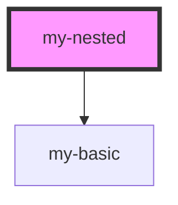

# my-basic

<!-- Auto Generated Below -->

## Properties

| Property | Attribute | Description | Type     | Default |
| -------- | --------- | ----------- | -------- | ------- |
| `first`  | `first`   |             | `string` | `''`    |
| `last`   | `last`    |             | `string` | `''`    |

## Dependencies

### Depends on

- [my-basic](../basic)

### Graph

----------------------------------------------

*Built with [StencilJS](https://stenciljs.com/)*
